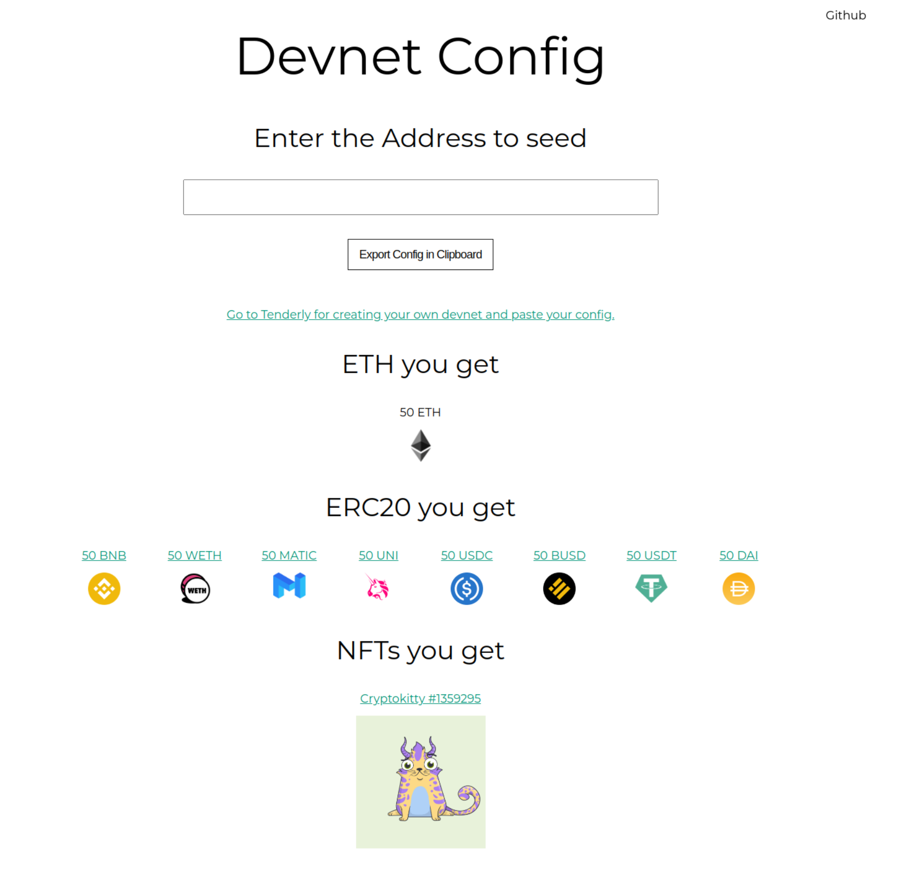

# Configure your own Tenderly Network

- [Live project](https://devnet-config.onrender.com)

## Run locally
1. Clone the repository
`git@github.com:seaona/config-your-devnet.git`
2. Install the dependencies
`npm i`
3. Run the server
`npm run start`
